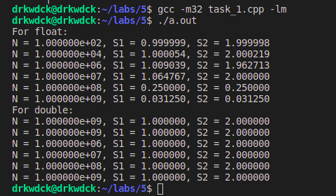

# Лаборатрная работа №4
## ПМ-31
Шувалова Виктория, Сахно Андрей, Решетников Егор
### Вариант 6

# Задание 1
Разработайте программу на языке C++, выполняющую вычисления
над вещественными числами одинарной точности (тип float).\
Проверьте, что программа действительно работает с операндами одинарной
точности, а не приводит к типу float окончательный результат.\
&nbsp;


### Код:
````cpp
#include "stdio.h"
#include "math.h"

template<typename T> 
T GetFirstSum(T n)
{
    T result = 0;

    for (int i = 0; i < n; ++i)
    {
        result += 1 / n;
    }

    return result;
}
template<typename T> 
T GetSecondSum(T n)
{
    T result = 0;

    for (int i = 0; i < 2 * n; ++i)
    {
        result += 1 / n;
    }

    return result;
}

int main()
{
    printf("For float:\n");
    float N = 0;

    N = pow((float)10, (float)2);
    printf("N = %e, S1 = %f, S2 = %f\n",N , GetFirstSum<float>(N), GetSecondSum<float>(N));

    N = pow((float)10, (float)4);
    printf("N = %e, S1 = %f, S2 = %f\n",N , GetFirstSum<float>(N), GetSecondSum<float>(N));

    N = pow((float)10, (float)6);
    printf("N = %e, S1 = %f, S2 = %f\n",N , GetFirstSum<float>(N), GetSecondSum<float>(N));

    N = pow((float)10, (float)7);
    printf("N = %e, S1 = %f, S2 = %f\n",N , GetFirstSum<float>(N), GetSecondSum<float>(N));

    N = pow((float)10, (float)8);
    printf("N = %e, S1 = %f, S2 = %f\n",N , GetFirstSum<float>(N), GetSecondSum<float>(N));

    N = pow((float)10, (float)9);
    printf("N = %e, S1 = %f, S2 = %f\n",N , GetFirstSum<float>(N), GetSecondSum<float>(N));
    
    
    printf("For double:\n");
    double doubleN = 0;

    doubleN = pow((double)10, (double)2);
    printf("N = %e, S1 = %f, S2 = %f\n",N , GetFirstSum<double>(doubleN), GetSecondSum<double>(doubleN));

    doubleN = pow((double)10, (double)4);
    printf("N = %e, S1 = %f, S2 = %f\n",N , GetFirstSum<double>(doubleN), GetSecondSum<double>(doubleN));

    doubleN = pow((double)10, (double)6);
    printf("N = %e, S1 = %f, S2 = %f\n",doubleN , GetFirstSum<double>(doubleN), GetSecondSum<double>(doubleN));

    doubleN = pow((double)10, (double)7);
    printf("N = %e, S1 = %f, S2 = %f\n",doubleN , GetFirstSum<double>(doubleN), GetSecondSum<double>(doubleN));

    doubleN = pow((double)10, (double)8);
    printf("N = %e, S1 = %f, S2 = %f\n",doubleN , GetFirstSum<double>(doubleN), GetSecondSum<double>(doubleN));

    doubleN = pow((double)10, (double)9);
    printf("N = %e, S1 = %f, S2 = %f\n",doubleN , GetFirstSum<double>(doubleN), GetSecondSum<double>(doubleN));

}
````
### Для запуска
Из директории с 5 лабой:
````console
$gcc -m32 task_1.cpp -lm
$./a.out 
````
### Результат выполнения:
\
Результата можно объяснить ошибкой округления, когда числа приводятся к одному порядку. При работе с double ошибки нет, так как double вмещает больше знаков и при приведении точность в нашем случае не теряется.

# Задание 2-3
### Задание 2
Составьте программу calc для вычисления выражения с использованием сопроцессора в соответствии со своим вариантом.
### Задание 3
Оформите вычисления из задания 2 как функцию на ассемблере (вещественную от вещественного аргумента x).
&nbsp;

### Код
#### task_2-3.cpp
````cpp
#include <stdio.h>
#include "math.h"

// cos(x) / (sin(2x) + 1.5)

double calc(double x)
{
    return cos(x) / (sin(2*x) + 1.5);
}

int main()
{
    double c = 1.5;
    double x = M_PI / 4, y;

    asm(
        "fldl %[x]\n"
        "fcos\n"

        "fldl %[c]\n" 
        "fldl %[x]\n"
        "fldl %[x]\n"

        "fadd\n"
        "fsin\n"
        "fadd\n"
        "fdivr\n"

        "fstpl %[y]\n"
        :[y]"=m"(y)
        :[x]"m"(x), [c]"m"(c)
    );

    printf("From asm: %f\n",y);
    printf("From C++: %f\n", calc(x));
}
````
### Для запуска
Из директории с 5 лабой:
````console
$gcc -m32 task_2-3.cpp -lm 
$./a.out 
````
### Результат выполнения:

